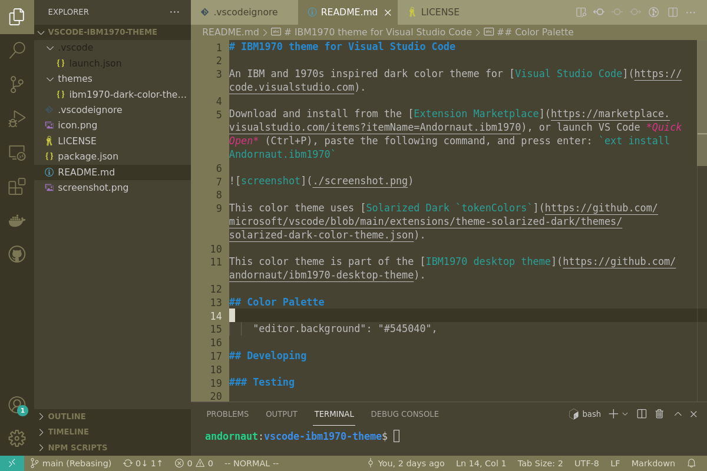

# IBM1970 theme for Visual Studio Code

An IBM and 1970s inspired dark color theme for [Visual Studio Code](https://code.visualstudio.com).

Download and install from the [Extension Marketplace](https://marketplace.visualstudio.com/items?itemName=Andornaut.ibm1970), or launch VS Code *Quick Open* (Ctrl+P), paste the following command, and press enter: `ext install Andornaut.ibm1970`



This color theme uses [Solarized Dark `tokenColors`](https://github.com/microsoft/vscode/blob/main/extensions/theme-solarized-dark/themes/solarized-dark-color-theme.json).

This color theme is part of the [IBM1970 desktop theme](https://github.com/andornaut/ibm1970-desktop-theme).

## Developing

### Testing

1. Press F5 to launch an Extension Development Host window.
1. Select: File > Preferences > Color Theme > IBM 1970

### Publishing

* [Official docs](https://code.visualstudio.com/api/working-with-extensions/publishing-extension)

```
nvm use
npm install -g @vscode/vsce
vsce login Andornaut

vsce package
vsce publish
vsce publish patch
vsce publish minor
vsce publish major
```

### Documentation

* [Extension guide: color theme](https://code.visualstudio.com/api/extension-guides/color-theme)
* [Publishing extensions](https://code.visualstudio.com/api/working-with-extensions/publishing-extension)
* [Theme color documentation](https://code.visualstudio.com/api/references/theme-color)
