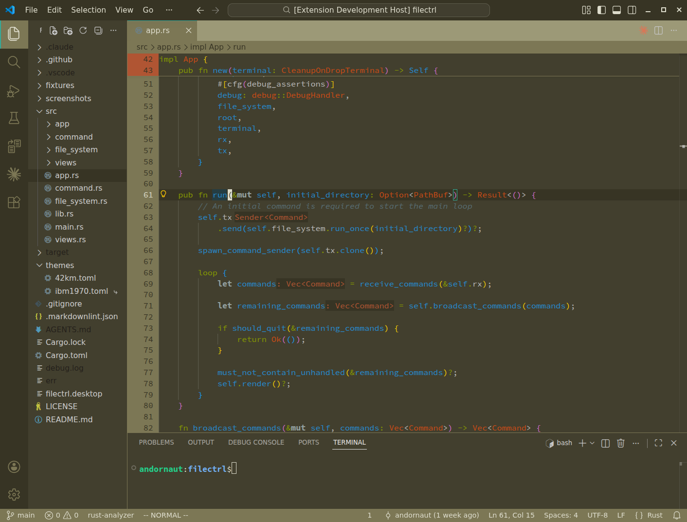
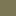

# IBM1970 theme for Visual Studio Code

An IBM and 1970s inspired dark color theme for [Visual Studio Code](https://code.visualstudio.com).

## Installation

1. Install from the [Extension Marketplace](https://marketplace.visualstudio.com/items?itemName=Andornaut.ibm1970)
   * Alternatively, press CTRL+p to open the "Quick Open" menu, and run the following command: `ext install Andornaut.ibm1970`
1. Select: File > Preferences > Themes > Color Theme > IBM 1970



This color theme is part of the [IBM1970 desktop theme](https://github.com/andornaut/ibm1970-desktop-theme).

## Colors

### UI

| Color | Hex | Usage |
| ----- | --- | ----- |
|  Teal | `#33A999` | Accent — links, badges, borders, find match, tab top |
|  Dark Teal | `#006B6B` | Editor selection |
|  Rust | `#b05533` | Inlay hints, sticky scroll gutter, notifications, status bar, sash hover, scrollbar active/hover |
|  White | `#ffffff` | Inactive title bar foreground |
|  Cream | `#dddccc` | Primary foreground |
|  Tan | `#d2bb84` | Modified files |
|  Khaki | `#9c9977` | Tab backgrounds, scrollbar, gutter headers |
|  Olive | `#7c7755` | UI borders, status bar, activity bar |
|  Dark Olive | `#545040` | Toolbar active |
|  Brown | `#423f2e` | Editor background |
|  Dark Brown | `#373424` | Panel backgrounds, inputs, terminal background |
|  Near Black | `#24201A` | Drop backgrounds, shadows |

### Syntax

This color theme uses [Solarized Dark](https://ethanschoonover.com/solarized/) [`tokenColors`](https://github.com/microsoft/vscode/blob/main/extensions/theme-solarized-dark/themes/solarized-dark-color-theme.json).

| Color | Hex | Usage |
| ----- | --- | ----- |
|  Green | `#859900` | Keywords, variable start, library class/type, diff inserted |
|  Cyan | `#2AA198` | Strings, markup inline |
|  Blue | `#268BD2` | Variables, functions, tags, headings, diff header |
|  Violet | `#6C71C4` | Inherited class |
|  Magenta | `#D33682` | Numbers, markup styling |
|  Orange | `#CB4B16` | Class names, constants, exceptions, diff changed |
|  Yellow | `#B58900` | Built-in constants, markup lists |
|  Red | `#DC322F` | Errors, regexp, invalid, diff deleted |
|  Light Gray | `#93A1A1` | Storage, tag attributes |
|  Base0 | `#839496` | Default foreground |
|  Dark Gray | `#586E75` | Comments, tag delimiters |

Color swatches are generated by [color-swatches-action](https://github.com/andornaut/color-swatches-action).

## Developing

### Testing

1. Press F5 to launch an Extension Development Host window.

### Publishing

A [Release workflow](.github/workflows/release.yml) runs on every push to `main` and on version tags (`v*`). It packages the extension into a `.vsix` file and publishes it as a GitHub release.

To publish to the VS Code Marketplace:

* [Publishing extensions](https://code.visualstudio.com/api/working-with-extensions/publishing-extension)
* [Get a Personal Access Token](https://code.visualstudio.com/api/working-with-extensions/publishing-extension#get-a-personal-access-token) — set **Organization** to **All accessible organizations**
* [Manage publishers and extensions](https://marketplace.visualstudio.com/manage/publishers/Andornaut)

```bash
npm version patch  # or minor, major
git push --follow-tags
npx vsce login Andornaut
npx vsce publish
```

### Guides

* [Extension guide: color theme](https://code.visualstudio.com/api/extension-guides/color-theme)
* [colorRegistry.ts](https://github.com/microsoft/vscode/blob/main/src/vs/platform/theme/common/colorRegistry.ts) — authoritative source for all valid theme color keys
* [Theme color documentation](https://code.visualstudio.com/api/references/theme-color)
